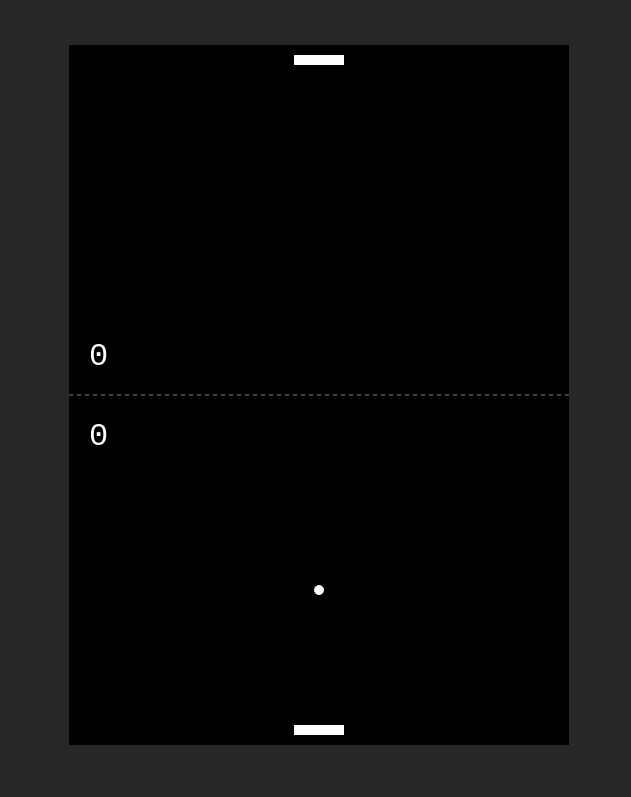

# advancedJS_Ping Pong: [LIVE DEMO](https://shcoobz.github.io/advancedJS_ping-pong/)

## Summary

advancedJS_Ping Pong provides a simple yet engaging ping-pong game implemented in React. It features a user-friendly interface and responsive controls, making it easy to play on both desktop and mobile devices.

The core functionality includes:

- Real-time gameplay against an automated opponent.
- Responsive game controls with mouse movement.
- Score tracking and display during gameplay.
- End-game detection with automatic win/loss announcement.

## Features

### Real-time Gameplay

The game runs in real time using the browser's requestAnimationFrame for smooth animation and gameplay dynamics. Players can instantly see the result of their actions, enhancing the interactivity of the game.

### Score Tracking

Score tracking is implemented to keep track of both the player's and the computer's scores throughout the game. Scores are displayed at the top of the game canvas, allowing players to see their progress and how close they are to winning or losing.

### Responsive Controls

The player's paddle is controlled via mouse movements, providing a responsive and intuitive game control system. This feature makes it easy for users to play the game on a wide range of devices, adapting to different screen sizes and input methods.

### Additional Features

- Automatic speed adjustments: The ball's speed increases slightly with each paddle hit, making the game more challenging as it progresses.
- Game reset functionality: Players can start a new game immediately after one ends, without needing to reload the page.

## Technologies

- **React**: Used for building the user interface and managing state throughout the application.
- **HTML5 Canvas**: Utilized for rendering the game visuals, handling animations, and detecting collisions.
- **CSS**: Applied for basic styling of the game components.

---

_Note: This document provides an overview of advancedJS_Ping Pong. For detailed instructions and more information, please refer to the source code documentation._

_This project is a conversion from an earlier version built with vanilla JavaScript and HTML, available [here](https://github.com/Shcoobz/basicJS_ping-pong/). This conversion integrates React to enhance UI reactivity and maintainability._
